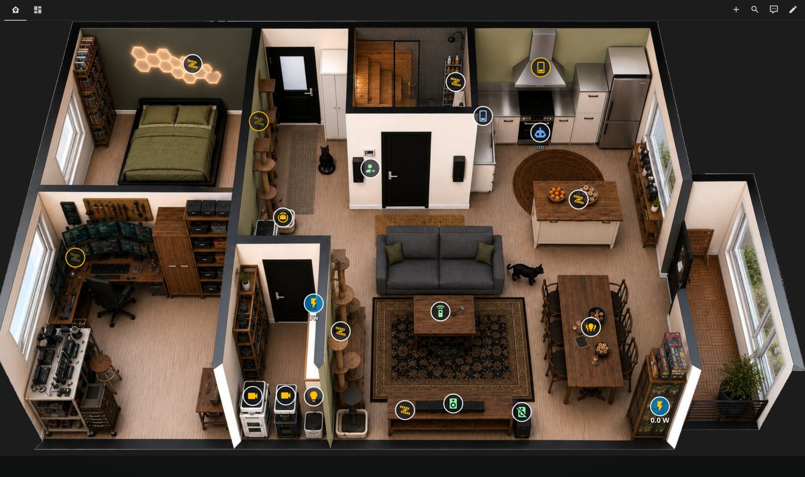

# Floorplan Studio for Home Assistant

A standalone, browser-based visual editor for designing interactive Home Assistant
floorplans and exporting them straight into a dashboard. **No backend, no install on
Home Assistant, works fully offline, no external CDNs, no telemetry.**

Drop in a photo or 3D render of your home, trace rooms and walls, place and configure
entity markers, preview them live against your HA, and export a dashboard-ready card —
either for the HACS **ha-floorplan** card or the native **Picture Elements** card.


---

## Demo



*A floorplan designed in Floorplan Studio and exported as a `ha-floorplan` card — live
entity icons (lights, media, cameras, locks), on/off state colouring, and power / label
readouts overlaid on a 3D render of the home.*

---

## Install in Home Assistant (HACS)

Run the full editor as a dashboard card, installed and updated through HACS — no
manual hosting.

1. **HACS → ⋮ (top-right) → Custom repositories.**
2. Repository: `https://github.com/tinkersoder/floorplan-studio` — Type: **Dashboard**. Click **Add**.
3. Open the new **Floorplan Studio** entry → **Download**. HACS registers the plugin JS
   as a Lovelace resource for you.
4. Hard-reload your browser (Ctrl-F5 / Cmd-Shift-R).
5. Edit a dashboard → **Add card → Manual** (or pick *Floorplan Studio* from the card
   list) and use:

   ```yaml
   type: custom:floorplan-studio-card
   # height: 90vh   # optional — defaults to 85vh
   ```

The card renders the whole editor inside the dashboard. Projects are stored in your
browser (IndexedDB), exactly like the standalone app. Prefer a full-page experience or
no HACS? The standalone build below still works.

---

## Features

- **Canvas** — upload / paste / drag-drop a background; adjust opacity, scale, position,
  rotation; set canvas size; zoom & pan; toggleable grid with snap; lock the background.
- **Markers** — add entities from the HA list (search + filter) or type an `entity_id`;
  multiple entities per marker; styles: MDI icon, dot, live state label, image, custom
  SVG; per-marker tap / hold / double-tap actions (toggle, more-info, call-service with a
  data editor, navigate, url); **state-based styling** (on/off, threshold, gradient
  heatmap, string match) with pulse/blink and conditional visibility; drag, multi-select,
  arrow-key nudge, duplicate.
- **Rooms** — draw polygons, name them, map to an HA area, fill colour + opacity,
  **state-based room colouring**, and click actions.
- **Walls / doors / windows** — polyline wall tracing with grid + 15° angle snapping;
  doors/windows that snap onto walls; thickness/colour styling.
- **Layers & floors** — show/hide/lock the background / walls / rooms / entities / labels
  layers; multiple floors with a switcher, each with its own background.
- **Live preview** — EDIT vs PREVIEW; preview uses real HA states when connected, or the
  built-in demo set otherwise.
- **Home Assistant connect (optional)** — URL + long-lived token over the WebSocket API;
  pulls the entity + area registries and subscribes to live states; "Test connection"
  button with clear CORS / mixed-content guidance. Token stays in your browser and is
  only ever sent to your own HA.
- **Persistence** — named projects in IndexedDB with autosave; JSON export/import for
  portable backups; undo/redo history.
- **Export** — ha-floorplan (SVG + `custom:floorplan-card` YAML + stylesheet), Picture
  Elements YAML, and Raw SVG / PNG. Background image can be **embedded** as a base64 data
  URI (self-contained, default) or **referenced** as `/local/floorplan/…` with copy
  instructions. One-click Copy / Download and an in-app help panel.

## Tech stack

React + TypeScript + Vite, a hand-rolled SVG editor (so the live document maps 1:1 to the
exported ha-floorplan SVG), Zustand + Immer for state and undo/redo, `idb` for IndexedDB,
`js-yaml` for export, `home-assistant-js-websocket` for the optional HA link, and bundled
`@mdi/js` icon path data. Everything is bundled — no runtime CDN requests.

## Prerequisites

You need **Node.js 18+** (npm ships with it) and **Git**. The `npm` commands below are
identical on Windows, macOS, and Linux — only the one-time tool install differs.

<details>
<summary><strong>Windows</strong></summary>

Using [winget](https://learn.microsoft.com/windows/package-manager/) (built into Windows 10/11):

```powershell
winget install OpenJS.NodeJS.LTS
winget install Git.Git
```

Or download the installers directly: [Node.js LTS](https://nodejs.org/en/download) and
[Git for Windows](https://git-scm.com/download/win). Then run the commands below in
**PowerShell** or **Windows Terminal**.
</details>

<details>
<summary><strong>macOS</strong></summary>

Using [Homebrew](https://brew.sh):

```bash
brew install node git
```

Or download the [Node.js LTS installer](https://nodejs.org/en/download) (Git is included
with the Xcode Command Line Tools: `xcode-select --install`). Then run the commands below
in **Terminal**.
</details>

<details>
<summary><strong>Linux</strong></summary>

Install from your distro (or [nodejs.org](https://nodejs.org/en/download)):

```bash
# Debian / Ubuntu
sudo apt install nodejs npm git
# Fedora
sudo dnf install nodejs git
# Arch
sudo pacman -S nodejs npm git
```
</details>

## Get the code

```bash
git clone https://github.com/tinkersoder/floorplan-studio.git
cd floorplan-studio
```

## Run (development)

```bash
npm install
npm run dev
```

Open http://localhost:5178 in your browser. Same on all platforms.

## Build (static site)

```bash
npm run build      # type-checks, then outputs a static bundle to dist/
npm run preview    # serve the built bundle locally
```

`dist/` is a fully static, path-relative site (`base: './'`). Host it anywhere:

- **Any static host / CDN** — Netlify, Vercel, GitHub Pages, Cloudflare Pages: point it at
  `dist/`.
- **A plain web server** — `npx serve dist` or copy `dist/` behind nginx/Caddy.
- **From Home Assistant itself** — copy `dist/` into `/config/www/floorplan-studio/` and
  open `http://<ha>:8123/local/floorplan-studio/index.html`. Serving it from the same
  origin as HA also sidesteps CORS entirely.

> Tip: use the **same scheme** (http/https) for the app and your HA instance, otherwise the
> browser blocks the connection as mixed content. See the in-app help / troubleshooting.

## Tests

```bash
npm test
```

Includes a golden-fixture test asserting the ha-floorplan SVG + card YAML match the
structure that drops straight into a dashboard.

## Project data

Projects live in your browser's IndexedDB and autosave as you work. Use **Projects → Export
current as JSON** for a portable backup, and **Import JSON…** to restore it elsewhere. The
JSON is the complete project (floors, background data URIs, markers, rooms, walls, rules).

## See also

- [`USER_GUIDE.md`](USER_GUIDE.md) — connecting HA, designing a floorplan, and adding the
  export to a dashboard (both ha-floorplan and picture-elements paths).
- [`CHANGELOG.md`](CHANGELOG.md) — release history.

## Author

Built by **Tinker Söder** ([@tinkersoder](https://github.com/tinkersoder)).

## License

Released under the [MIT License](LICENSE). © 2026 Tinker Söder.
